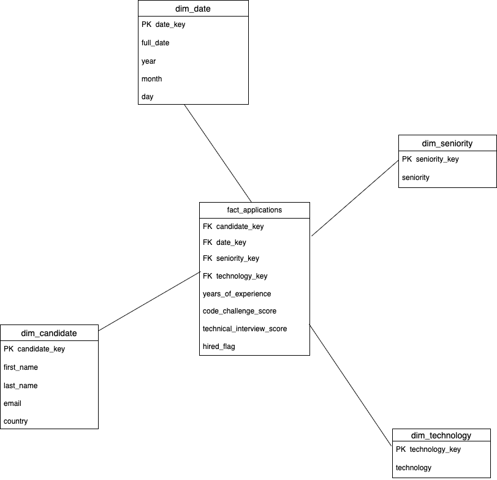
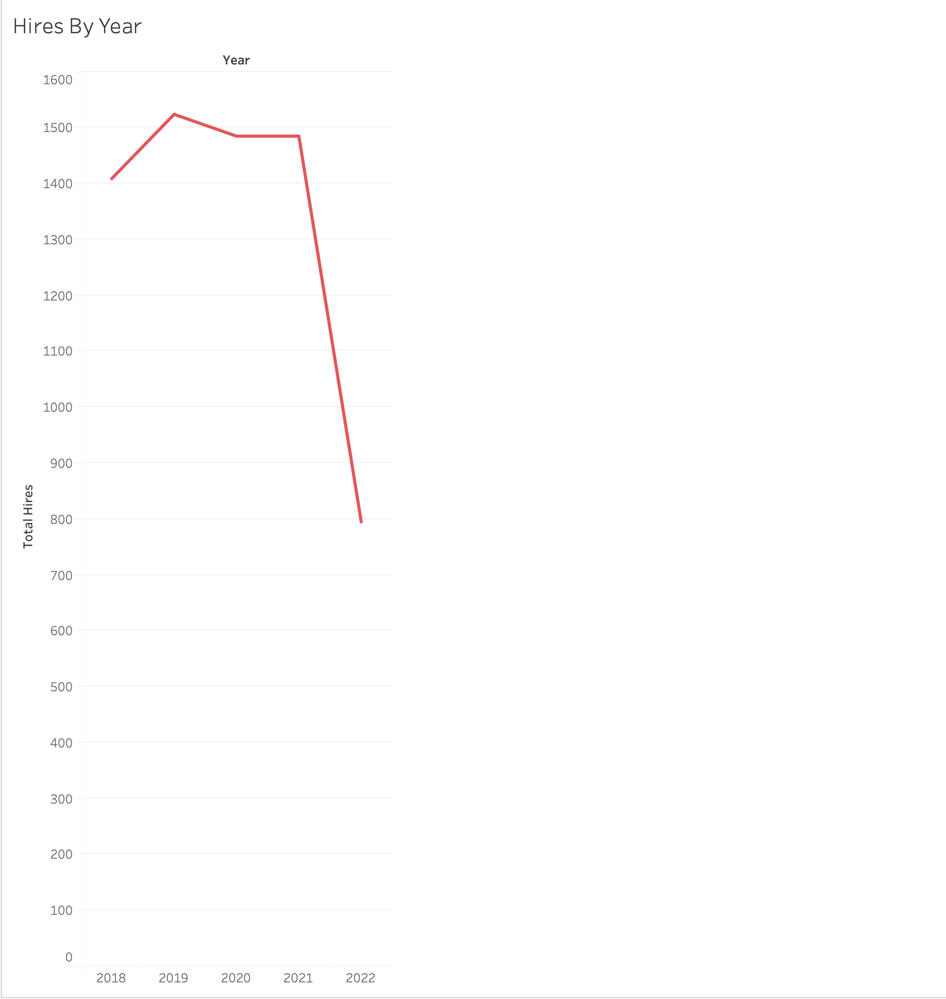
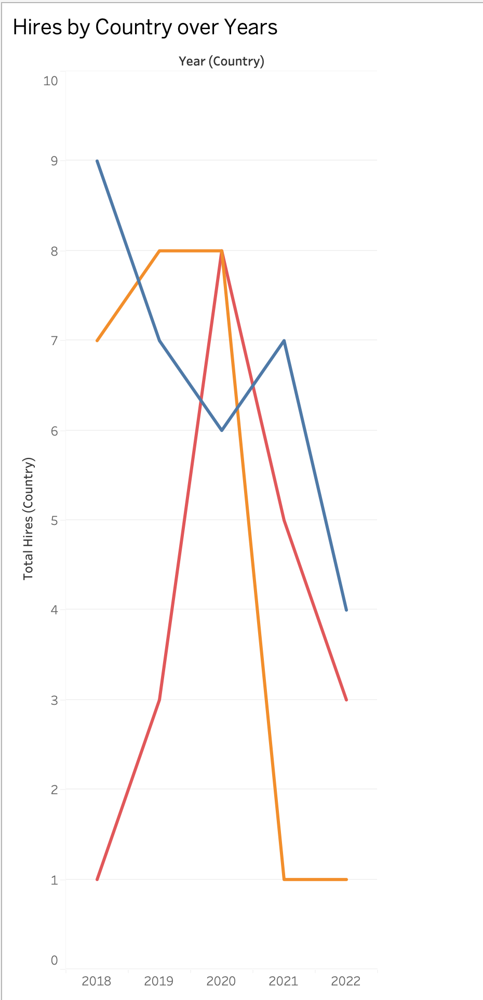
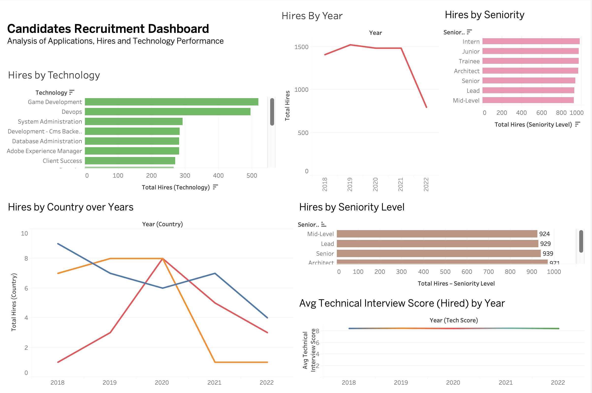

# ETL Workshop 1 – Candidates Data Warehouse

## 1. Project Overview

This project implements a complete ETL process to build a Data Warehouse for candidate applications.
The objective was to extract raw data from a CSV file, perform data quality validations and transformations, design a dimensional model using a Star Schema, and load the data into a structured analytical model.

The final result supports business analysis such as hiring performance, technology demand, and application trends over time.

## 2. Dataset Description

The raw dataset (candidates.csv) contains information about candidate applications, including:

First Name

Last Name

Email

Application Date

Country

Years of Experience (YOE)

Seniority

Technology

Code Challenge Score

Technical Interview Score

Each row represents one job application submitted by a candidate.

## 3. Exploratory Data Analysis (EDA – Raw Data)

An exploratory data analysis was performed on the raw dataset before applying any transformations.

The following validations were performed:

Structure inspection using df.info()

Data type verification

Missing value check

Duplicate row validation

Duplicate email validation

Score range validation

Unique value inspection for categorical columns

Date format inspection

Distribution analysis using histograms

## 4. Data Quality Findings

The raw dataset presented the following characteristics:

No missing values were found.

No fully duplicated rows were detected.

167 duplicated email records were identified.

Score values follow a 0–10 scale.

Date fields were stored as strings and required conversion.

Country contained 244 unique values.

Categorical fields required standardization (case and spacing).

These findings guided the transformation phase.

## 5. Dimensional Modeling – Star Schema

A Star Schema was designed to organize the Data Warehouse.

This structure was selected because it is simple, efficient for analytical queries, and easy to understand.

The model consists of:

One fact table

Four dimension tables

The following diagram represents the dimensional model implemented in this project:

The Star Schema was chosen to simplify analytical queries and improve performance in aggregation scenarios. 

Dimension tables store descriptive attributes, while the fact table stores measurable metrics. 

Surrogate keys were implemented to ensure stable relationships and avoid dependency on natural keys from the raw dataset.

## 6. Grain Definition

The grain of the fact table is:

One row per candidate application.

Each record represents a single application submitted by a candidate on a specific date, associated with a specific technology and seniority level.

Since a candidate can apply multiple times, the level of detail is the application, not the candidate.

Defining the grain clearly ensures consistent aggregations and avoids ambiguity.

## 7. Tables Structure

Dimension Tables

dim_candidate

candidate_key (surrogate key)

first_name

last_name

email

country

dim_date

date_key (YYYYMMDD)

full_date (YYYY-MM-DD)

year

month

day

dim_seniority

seniority_key

seniority

dim_technology

technology_key

technology

Fact Table – fact_applications

candidate_key

date_key

seniority_key

technology_key

years_of_experience

code_challenge_score

technical_interview_score

hired_flag

The fact table stores measurable values and connects to each dimension using foreign keys.

## 8. ETL Process
Extract

The raw CSV file was loaded using pandas with the correct delimiter (sep=";").
Column names were inspected and verified before transformation.

Transform

The transformation phase addressed the issues identified during EDA.

Main steps:

Created hired_flag based on business rule:

Score ≥ 7 in both evaluations

Standardized text fields (trim spaces, consistent casing)

Converted numeric columns to appropriate data types

Converted date field to datetime format

Removed records without Email or Application Date

Removed duplicate records based on defined grain

Generated surrogate keys for all dimension tables

Ensured no null foreign keys in fact table

Load

In the load phase, the transformed data was inserted into the MySQL Data Warehouse (dw_candidates).

The tables were first created using the SQL script located in sql/create_tables.sql, defining primary and foreign keys.

The data was loaded in the following order to maintain referential integrity:

dim_candidate

dim_date

dim_seniority

dim_technology

fact_applications

After loading, a basic validation was performed to confirm that all foreign keys in the fact table correctly reference existing dimension records.

## 9. SQL Implementation

SQL scripts were created to generate the Data Warehouse tables in MySQL.

Primary keys and foreign key relationships were defined to ensure referential integrity between fact and dimension tables.

The Data Warehouse database used was:

dw_candidates

## 10. Tableau Integration

To connect Tableau on macOS to MySQL:

Installed iODBC drivers.

Installed MySQL ODBC Connector.

Connected to the local server using:

Host: localhost

Port: 3306

Database: dw_candidates

Tableau successfully recognized the fact and dimension tables, allowing the creation of analytical dashboards.

KPIs created include:

- Total Hires by Year: Measures overall hiring trends and variations over time.
- Total Hires by Country Over Time: Evaluates geographic distribution of hires and its evolution.
- Total Hires by Technology: Identifies the most demanded technologies in the recruitment process.
- Total Hires by Seniority: Analyzes hiring distribution across experience groups.
- Average Technical Interview Score (Hired) by Year: Assesses the technical quality of hired candidates and consistency of hiring standards over time.

## 11. Example Outputs

The following examples illustrate analytical results generated from the Data Warehouse:

Total Hires by Year

Total Hires by Technology

Total Hires by Country Over Time

Total Hires by Seniority Level

Average Technical Interview Score (Hired) by Year

Recruitment Analytics Dashboard

## 12. How to Run the Project

   1. Clone the repository.
   2. Install required Python dependencies.
   3. Place the raw CSV file in the data/raw folder.
   4. Run the ETL pipeline using:
      python src/main.py
   5. Execute the SQL script in sql/create_tables.sql to create the Data Warehouse schema.
   6. Connect Tableau to the MySQL database dw_candidates.

# Author: Gonoalejo
